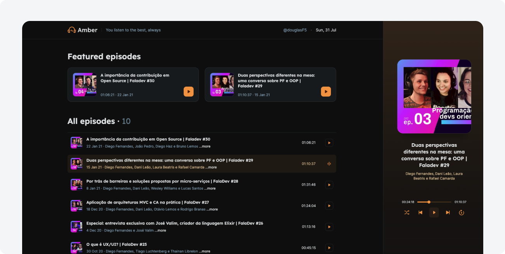
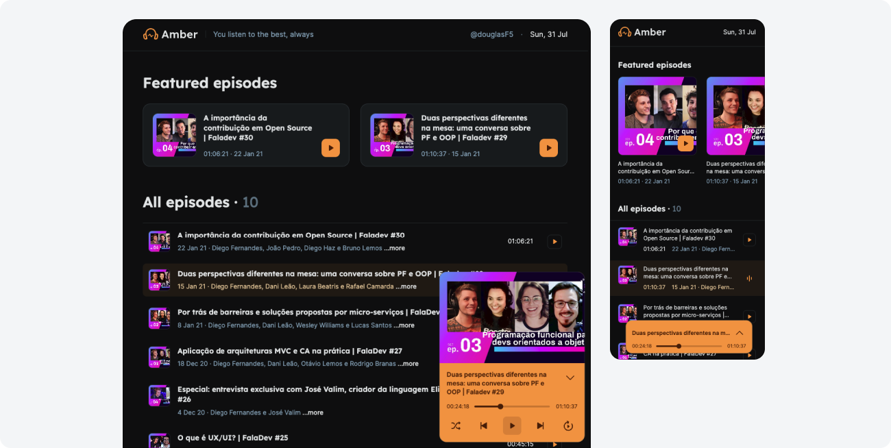

# Amber podcasts web app

* [About](#about)
* [Project screenshots](#project-screenshots)
* [Installation](#installation)
* [Extra notes](#extra-notes)

## About
Amber is a simple front-end application for a podcast platform.

#### Tools:

- ReactJS
- NextJS
- TypeScript
- SASS
- Axios
- Framer Motion
- Other utility libraries: Date fns, SVGR, react-scroll, react-responsive, tippy, rc-slider

#### Implemented features:

- Listing podcasts
- Audio player
- SSR with NextJS
- Consuming data with Axios
- Transitions and animations with Framer Motion
- Responsive layout

 

## Project screenshots

 
 

 

## Installation

- Install it by running `yarn` in the project's root directory
- Start the dev server with `yarn dev`
- Start the API server with `yarn server`
- Build the project with `yarn build`

 

## Extra notes

- This project is purely a practical exercise intended for developing and/or showcasing my skills in the tools/techniques/concepts mentioned above. It's not meant to be a complete production-ready solution. Feel free to reach out if you have any questions or simply want to chat about it!
- This exercise was built following lessons by [Rocketseat](https://www.rocketseat.com.br/). It may or may not have been adapted/redesigned by me.
